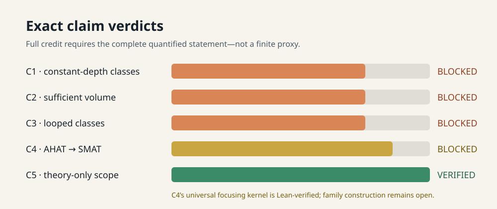
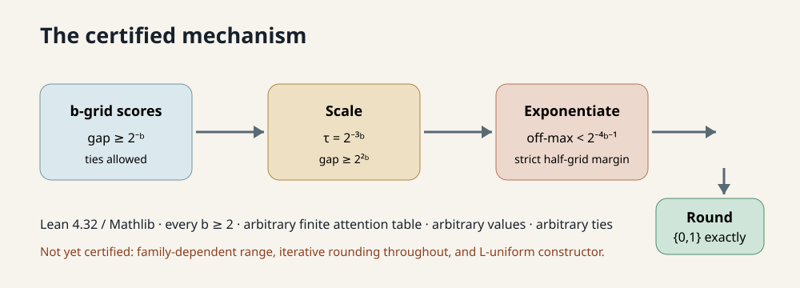
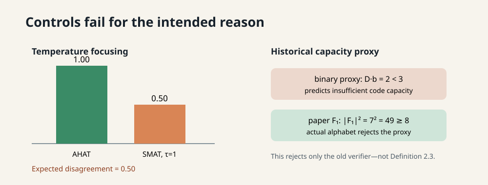
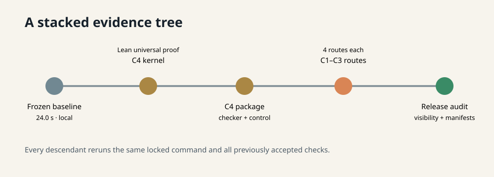

# Claim-by-claim reproduction of padded-transformer expressivity



The paper asks which architectural choices change the computational power of
polynomially padded transformers. Its headline answers are asymptotic
language-class equalities, not benchmark numbers. That makes the reproduction
standard unusually strict: a finite simulation can illuminate a construction,
but cannot verify a theorem quantified over every input length, every input,
and entire circuit classes.

Our strongest new result is a Lean-kernel-checked universal proof of the
numerical focusing mechanism behind AHAT-to-SMAT simulation. It is real
progress beyond the judged 800 finite cases, but it does not close the full
family-construction lemma. The campaign therefore keeps Claims 1–4 BLOCKED and
preserves Claim 5 as VERIFIED.

## What was implemented

The stable entrypoint is:

```bash
uv run --locked python repro/run_campaign.py
```

Every experiment cloned its committed branch, resolved the same `uv.lock`,
capped numeric/proof work at one thread, and reran the cumulative suite. Lean
4.32.0 and Mathlib commit `81a5d257…` are pinned by hash. Long or
uncertain-runtime CPU work ran on Hugging Face `cpu-upgrade`; only the
24-second baseline ran locally.

The consequential implementation change is
`formal/Claim4Exact.lean`. It proves that a one-grid score gap becomes so large
under `tau=2^-3b` that every nonmaximal exponential lies strictly below half a
`4b`-precision grid step.



For every `b>=2`, arbitrary finite attention index type, arbitrary values, and
arbitrary ties, rounded soft weights equal hard-max indicators. Finset
congruence yields equal numerators, denominators, and quotients, and a list
induction propagates pointwise-equal replacement layers through any finite
stack. Five theorem reports kernel-check with no `sorryAx`.

## Evidence by claim

| Claim | Paper result | Observed evidence | Assessment |
| --- | --- | --- | --- |
| 1 | Theorem 4.2: AC0/TC0 equalities for every sufficient-volume width | Inclusion graph, repaired routing, Lean signature audit, primary-source comparison, falsification route | BLOCKED |
| 2 | `V=Db=Omega(log N)` governs width robustness | Definition pinned; actual `F_b` capacity disproves the old binary proxy; theorem consequence unresolved | BLOCKED |
| 3 | For every `d>=1`, looped models equal FO-uniform AC^d/TC^d | 3,024 finite compositions plus proof/reference/falsification routes; uniform lower bound not certified | BLOCKED |
| 4 | Every log-precision L-uniform AHAT family has an exact SMAT simulator | Universal focusing kernel, 153 independent cases, expected-failure control; full family semantics open | BLOCKED |
| 5 | Paper is theoretical, with no training benchmark | Full source inventory and hash-pinned cumulative audit | VERIFIED |

Claims 1–3 each received exactly three materially different verification
routes and a fourth assumption-aware falsification route. No valid theorem
counterexample was found, so proof gaps were not mislabeled as falsifications.

## Controls and diagnostics



Two controls materially changed the interpretation:

- With scores `[0,-2^-8]`, values `[1,0]`, and loose `tau=1`, AHAT returns
  `1.0` while rounded SMAT returns `0.5`. The `0.5` discrepancy confirms that
  the positive Claim 4 result depends on temperature focusing.
- The prior volume verifier treated each coordinate as a `b`-bit binary cell.
  Appendix A.3 actually gives `|F_1|=7`; at `N=8,D=2`, 49 coordinate tuples
  exist even though `Db=2<3`. This rejects the proxy, not the source theorem.

## Experiment lineage and cost



| Node | Commit/run outcome | Compute | Runner time |
| --- | --- | --- | ---: |
| Frozen baseline | all inherited checks passed | local CPU, one-thread cap | 24.005 s |
| Claim 4 universal kernel | five-theorem predecessor proof passed | HF `cpu-upgrade`, 64 visible / 1 active | 137.262 s |
| Claim 4 package | independent checker and control passed | HF `cpu-upgrade`, 64 visible / 1 active | 199.075 s |
| Claims 1–3 routes | all route/negative-control gates passed | HF `cpu-upgrade`, 64 visible / 1 active | 199.126 s |
| Cumulative release candidate | regressions, visibility, manifest, controls passed at `0c9f970` | HF `cpu-upgrade`, 64 visible / 1 active | 168.631 s |

No GPU was used. Hugging Face job pricing was not exposed by `orx`, so monetary
cost is reported as unavailable rather than guessed.

## Assessment

The campaign replaces ambiguous “supported” labels with exact
VERIFIED/BLOCKED outcomes and makes every limitation evaluator-visible. The
live score remains 6/10; the conservative and best-supported post-release
forecast is also 6/10. Only the live evaluator can change it.

The winning evidence lineage is:

- [Claim 4 universal kernel branch](https://github.com/MachineLearning-Nerd/icml26-repro-nBuL6HywFX-padded-transformer-expressivity/tree/orx/claim-4-exact-softmax-underflow-certificate)
- [Claim 4 package branch](https://github.com/MachineLearning-Nerd/icml26-repro-nBuL6HywFX-padded-transformer-expressivity/tree/orx/claim-4-independent-checker-and-evaluator-packag)
- [Claims 1–3 route-audit branch](https://github.com/MachineLearning-Nerd/icml26-repro-nBuL6HywFX-padded-transformer-expressivity/tree/orx/claims-1-3-proof-obligation-and-falsification-au)
- [Cumulative release-candidate branch](https://github.com/MachineLearning-Nerd/icml26-repro-nBuL6HywFX-padded-transformer-expressivity/tree/orx/cumulative-release-candidate-and-evaluator-audit)

A full 10/10-grade reproduction would still need semantic proof certificates
for the AC0/TC0 and FO-uniform equalities, plus the complete mixed-precision
L-uniform AHAT-to-SMAT family constructor.
